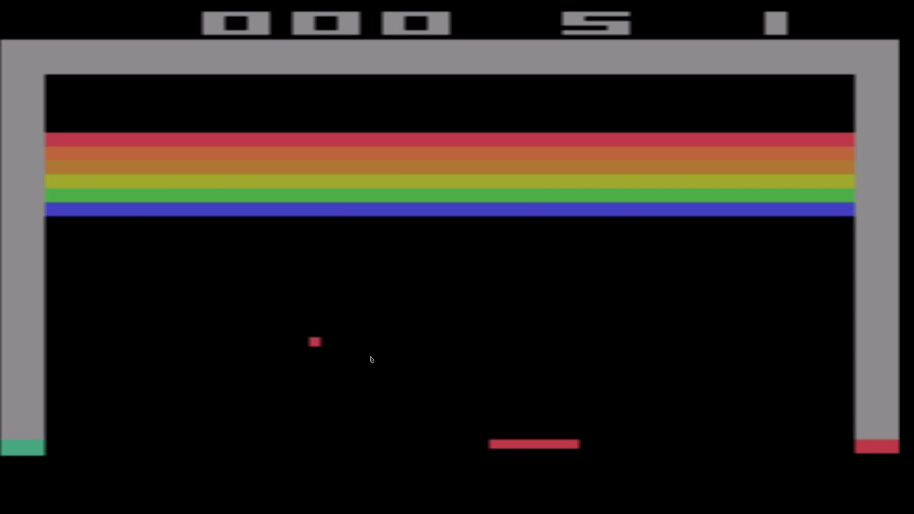
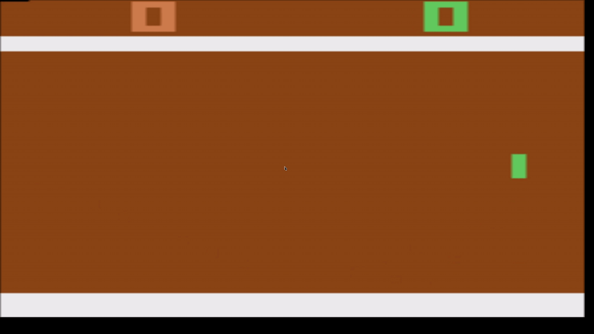

# AtariDQN
Here is a deep Q-network implemented in Pytorch that has learned to play classic Atari games, breakout and pong, with the python Gym library. Both agents trained in ~1 hour on an NVIDIA 1070ti. 
 
